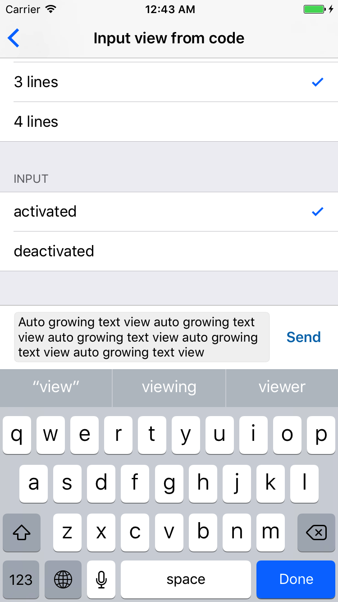

# ABTextView

Auto growing text view for iOS.



## Features

- simple to use and configure
- 2 resizing mode: using height or line count
- supports storyboards

## Requirements
- Xcode 9.0
- Swift 4.0

## Usage
```
see ABTextViewExample example project
```

## Authors

* **Alexander Barobin** - [GitHub](https://github.com/barobin)

## License

ABTextView is licensed under the Apache License 2.0 - see the LICENSE file for details